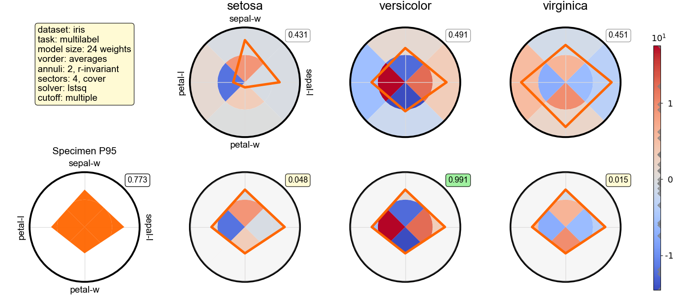

# Polygrid

Polygrid CLI is a line-oriented command interpreter built on Python's Cmd class.
It is a research prototype that was created to automate recurring tasks during the development of the Polygrid model, which was introduced in the following article:

> [1] Andre Paulino de Lima, Paula Castro, Suzana Carvalho Vaz de Andrade,
>     Rosa Maria Marcucci, Ruth Caldeira de Melo, Marcelo Garcia Manzato.
>     An interpretable recommendation model for psychometric data,
>     with an application to gerontological primary care. 2026.
>     Available at https://arxiv.org/abs/2601.19824
>     (and also here `./literature/polygrid_paper.pdf`)

Please cite the article if this software turns out to be useful for your research.
This work has derived from the following doctoral thesis:

> [2] Andre Paulino de Lima. An interpretable recommendation model for psychometric
>     data in multilabel classification and label ranking tasks, with an application
>     to gerontological primary care. 2026. Doctoral thesis (to be defended; the
>     pre-examination version can be consulted here `./literature/polygrid_thesis.pdf`)

Polygrid is a transparent, interpretable recommendation model that displays an interactive diagram as a visual explanation for any recommendation it provides, as illustrated below:



## Installation

Prerequisites: git and uv package manager.

After cloning this repository, run:

### on Windows:
```
set PARAM_MOUNTEDON=%CD%
cd polygrid\prototypes\code
uv run cli.py ..\configs\evaluate_H01_C1.cfg < ..\scripts\autotest.in
```

### on Ubuntu:
```
export PARAM_MOUNTEDON=`pwd`
cd polygrid/prototypes/code
uv run cli.py ../configs/evaluate_H01_C1.cfg < ../scripts/autotest.in
```

The installation takes a couple of seconds to create a virtual environment and install the necessary packages, and then run the script.
If the installation is successfull, the script will display the image above in a graphic window (separate from your terminal).
Check if the value of the tags match, then close the window.
Then you should see this message on your terminal: `Quitting session with 0 exception(s).`

Disclaimer: the procedures above were tested on Windows 11 and Ubuntu 24.04 (on WSL).


## Run a demo:
```
python cli.py ../configs/evaluate_H01_C1.cfg < ../scripts/demo.in
```

## How to run the Polygrid CLI:
```
python cli.py ../configs/evaluate_H01_C1.cfg
```

## Where is the supplementary data?
The data collected during the offline evaluation and the user study reported in the paper/thesis are available in `./datasets/offlineval` and `./datasets/userstudy` folders, respectively.

## How to learn more about the Polygrid model?
For a crash course on Polygrid model/CLI, consider watching some of these videos:

- I want to watch a 5-min intro to Polygrid model
 (soon)

- I want to watch a 5-min intro to Polygrid CLI
 (soon)

- I want to explore my dataset with the Polygrid CLI
 (soon)

Disclaimer: The first author provides this software "as is", with no express or implied warranties.
Also, the healthcare datasets mentioned in the paper/thesis above do not come with the software: interested users must request them from their owners or curators and preprocess them using the corresponding `read*.py` scripts found in the `./prototypes/readers` folder.
