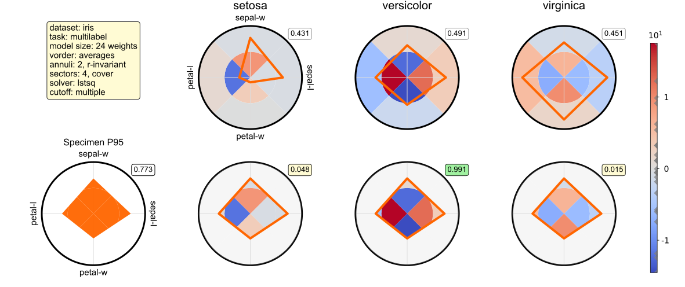

# Polygrid

Polygrid CLI is a line-oriented command interpreter built on Python's Cmd class.
It is a research prototype that was created to automate recurring tasks during the development of the Polygrid model, which was introduced in the following article:

> [1] Andre Paulino de Lima, Paula Castro, Suzana Carvalho Vaz de Andrade,
>     Rosa Maria Marcucci, Ruth Caldeira de Melo, Marcelo Garcia Manzato.
>     An interpretable recommendation model for psychometric data,
>     with an application to gerontological primary care. 2026.
>     Available at https://arxiv.org/abs/2601.19824 
>     (and also here ./literature/polygrid_paper.pdf)

This work has derived from the following doctoral thesis:

> [2] Andre Paulino de Lima. An interpretable recommendation model for psychometric
>     data in multilabel classification and label ranking tasks, with an application
>     to gerontological primary care. 2026. Doctoral thesis (to be defended).
>     (an examination copy can be consulted here ./literature/polygrid_thesis.pdf)

The detailed data collected from the offline evaluation and the user study reported in the paper/thesis are available in ./datasets/results and ./datasets/userstudy.

Polygrid is a transparent, interpretable recommendation model that displays an interactive diagram as a visual explanation for any recommendation it provides.


For a crash course on Polygrid model/CLI, consider watching some of these videos:

- I want a 5-min intro to Polygrid
 (soon)

- I want to watch a hands-on presentation of the paper (15-min)
 (soon)

- I want to explore my dataset with the Polygrid CLI
 (soon)

Please cite the article if this software turns out to be useful for your research.

Disclaimer: The first author provides this software "as is", with no express or implied warranties.
Also, the healthcare datasets mentioned in the paper/thesis above do not come with the software: users must request them from their owners or curators and preprocess them using the corresponding “read*.py” scripts found in the ./prototypes/readers folder.

##Installation (Windows):
- After cloning this repository, run:
```
cd polygrid
createnv.bat
activate polygrid
cd prototypes\code
python cli.py ..\configs\evaluate_H01_C4.cfg < ..\scripts\autotest.in
```

##Installation (Linux):
- After cloning this repository, run:
```
cd polygrid
install.sh
activate polygrid
cd prototypes/code
python cli.py ../configs/evaluate_H01_C1.cfg < ../scripts/autotest.in
```

##How to run the Polygrid CLI:
```
python cli.py ../configs/evaluate_H01_C1.cfg
```

##Run a demo:
```
python cli.py ../configs/evaluate_H01_C4.cfg < ../scripts/demo.in
```
